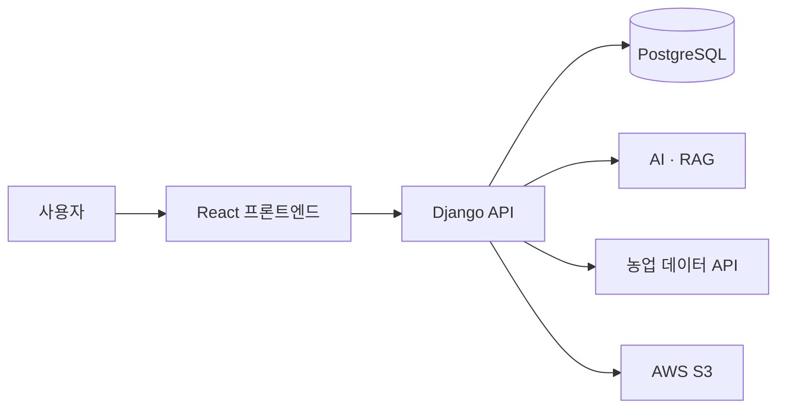

# 농업코파일럿

## 2026년 개인 개선·검증 (2026-09-18)

2024년 6인 팀 프로젝트 원본을 보존하면서, 외부 키와 AI 런타임 데이터 없이 재현 가능한 범위를 로컬에서 확인했습니다. Windows, Node.js 22.20.0, npm 10.9.3, Python 가상환경 3.11.9를 사용했습니다. 자동 테스트는 로컬 `.env` 로딩을 끄고 임시 Django 키, SQLite, 디버그 설정으로 실행했습니다. 자동 테스트에서는 실제 외부 API, 운영 DB, S3를 호출하지 않았습니다.

| 영역 | 실행한 명령과 결과 |
| --- | --- |
| Frontend | `npm ci --offline --no-audit --no-fund` 성공, `npm run lint` 통과, `CI=true npm test -- --watchAll=false --runInBand` 31 스위트·159 테스트 통과, `CI=true npm run build` 통과 |
| Backend | `python manage.py check` 문제 0개, `python manage.py migrate --noinput` 적용할 마이그레이션 없음, `python manage.py test` 130개 통과 (가상환경 Python 3.11.9, dotenv 비활성화·SQLite 설정) |

| 기능 | 자격증명 없이 검증한 범위 | 남은 검증 |
| --- | --- | --- |
| 병해충 진단 | 모델 파일 존재 여부 및 업로드·오류·화면 상태를 코드와 Mock 테스트로 확인 | `best.pt`, 선택 AI 패키지와 실제 이미지 추론·이력 저장에는 런타임 데이터 필요 |
| 토양검정 | 주소 검색→필지→토양·비료 화면 흐름과 API 예외 처리를 Mock 테스트로 확인 | 실제 비료 처방 및 여러 지역·시료의 응답은 미확인 |
| 수익 예측 | 입력 검증·외부 데이터 오류 처리와 이력 로딩·빈 결과·오류 후 재시도를 Mock 테스트로 확인 | 실제 예측 전체 흐름 및 여러 작물·지역의 응답은 미확인 |
| 챗봇 | 키·Chroma 부재 시 제한 상태와 요청 실패 처리를 Mock 테스트로 확인 | OpenAI 키, 원본 Chroma 인덱스 및 실제 질의 검증 필요 |

토양검정과 수익 예측은 로컬에서 각각 한 번만 수동 조회했습니다. 토양 시료 목록 1건, 날씨 365행, 시장가격 243행이 서비스 파서를 통과했습니다. `backend/soil/tests/fixtures/`와 `backend/prediction/tests/fixtures/`에는 **로컬 실연동에서 응답 구조를 확인하고 민감정보를 제거한 최소 계약 fixture**만 두었습니다. 주소·필지번호·인증정보·실제 날짜는 포함하지 않았으며, 필수 날짜는 예시값으로 바꿨습니다. fixture 테스트는 외부 API를 호출하지 않습니다. 이 결과는 실시간 데이터 정확성이나 외부 API 전체 호환성을 보장하지 않습니다.

2026년 개인 개선·검증에서는 수익 예측 이력 화면의 조회 실패를 빈 이력과 구분하고, 병해충 진단·챗봇의 준비 중·제한·상태 조회 오류 안내와 재확인 버튼을 추가했습니다. 기존 URL과 API 응답 구조는 유지했습니다. CI 설정은 프론트엔드 설치·lint·테스트·빌드 및 백엔드 설치·Ruff·check·테스트·의존성 검사를 실행하도록 되어 있으며, 이 문단은 로컬 실행 결과만 기록합니다. 실제 배포 동작은 확인하지 않았습니다.

GitHub Actions의 프론트엔드 job은 `npm ci` → `npm run lint` → `npm test` → `npm run build`, 백엔드 job은 의존성 설치 → Ruff 검사 → `python manage.py check` → `python manage.py test`를 실행합니다. CI에는 외부 API 키, 모델 파일, Chroma 인덱스를 주입하지 않으며, SQLite와 테스트 전용 Django 설정만 사용합니다.

병해충 모델 경로·Chroma 인덱스·OpenAI 키가 없는 설정에서도 Django 서버의 기본 화면과 기능 상태 API가 기동하고, 두 기능은 `limited`로 표시됩니다. 기능 요청은 성공으로 꾸미지 않고 503 오류로 처리하며 화면에서 제한 이유와 재확인 방법을 안내합니다. 챗봇 corpus가 없을 때 인덱스 생성 명령은 오류로 종료됩니다. `detect/views.py`의 클래스 계약과 `detect/fixtures/model_classes.json` 기준 지원 범위는 **출력 인덱스 6개, 고유 병해 정보 5개**입니다: 고추 탄저병·흰가루병, 오이 노균병·흰가루병, 토마토 흰가루병. 이는 코드·fixture의 매핑 범위이며 실제 모델 추론 정확도를 검증한 결과는 아닙니다.

> AI와 공공데이터를 연결해 수익 분석, 병해충 진단, 토양검정, 영농 상담을 제공하는 초보 농업인 지원 서비스

[](https://github.com/minjuko/farm-copilot/actions/workflows/ci.yml)

KT AIVLE School 5기 Big Project에서 6명이 함께 만든 서비스입니다. 프로젝트 당시 서비스명은 **꾼꾼농사꾼**이며, **Collaboration상**을 수상했습니다.

저는 프론트엔드 개발자로 참여해 공통 UI와 인증·커뮤니티를 구현했으며, 백엔드·AI·공공데이터 기능을 사용자가 이용할 수 있는 화면 흐름으로 연결했습니다.

> 이 저장소는 원본 팀 저장소를 바탕으로 실행환경, 프론트엔드 구조, 테스트와 문서를 정리한 개인 Fork입니다. AI 모델과 백엔드 전체 구현은 각 담당 팀원이 맡았습니다.

## 프로젝트 정보

| 항목 | 내용 |
| --- | --- |
| 기간 | 2024.06.17–2024.07.30 |
| 인원 | 6명 — 프론트엔드 2 · 백엔드 2 · AI/Server 2 |
| 본인 역할 | 프론트엔드 — 공통 UI · 주요 기능 연동 |
| 성과 | KT AIVLE School 5기 Big Project Collaboration상 |
| 원본 저장소 | [프론트엔드](https://github.com/kt-bigproject28/kunkunnongsakun) · [백엔드](https://github.com/kt-bigproject28/bigproject28) |
| 상세 문서 | [농업코파일럿 상세 기술문서](https://app.notion.com/p/3d1622cea8638005938aca8f9f7d905c) |

## 주요 기능

| 기능 | 사용자 흐름 |
| --- | --- |
| 농작물 수익 분석 | 재배 조건 입력 → 예상 소득·시장가격 분석 → 차트 확인 |
| AI 병해충 진단 | 작물 이미지 업로드 → YOLO 분석 → 병해충 정보·진단 이력 확인 |
| 토양검정·비료 처방 | 농지 주소 입력 → 토양 시료 선택 → 작물별 처방 확인 |
| 농업 AI 챗봇 | 대화 세션 생성 → 질문 전송 → RAG 기반 답변·이력 확인 |
| 농업 커뮤니티 | 판매·구매 게시글과 댓글 작성·조회·수정·삭제 |
| 회원·마이페이지 | 회원가입·로그인, 회원정보·사용자 활동 관리 |

## 서비스 화면

<table>
  <tr>
    <th width="50%">메인 화면</th>
    <th width="50%">농작물 수익 분석</th>
  </tr>
  <tr>
    <td align="center"></td>
    <td align="center"></td>
  </tr>
  <tr>
    <th>토양검정·비료 처방</th>
    <th>AI 병해충 진단</th>
  </tr>
  <tr>
    <td align="center"></td>
    <td align="center"></td>
  </tr>
</table>

> 화면 이미지는 팀 프로젝트 최종 시연 자료를 바탕으로 구성했습니다.

## 프로젝트 기술 스택

> 아래 기술은 프로젝트 전체 구성 기준입니다. 개인 구현 범위는 **본인 담당 및 기여** 섹션을 따릅니다.

| 영역 | 기술 |
| --- | --- |
| 프론트엔드 | React 18 · JavaScript · React Router · Axios · styled-components · Chart.js · Create React App |
| 백엔드 | Python · Django 5 · Django REST Framework |
| Database·Storage | PostgreSQL · AWS S3 |
| AI·Data | ElasticNet · YOLOv8 · PyTorch · pandas · NumPy · scikit-learn |
| RAG | LangChain · Chroma · OpenAI |
| External Data | Kakao 주소 검색 · aT 가격정보 · 기상청 ASOS · 농촌진흥청 토양검정·비료사용처방 V2 |

## 본인 담당 및 기여

### 팀 프로젝트 당시

| 영역 | 담당 내용 |
| --- | --- |
| 공통 UI | MainLayout · TopBar · GNB · 주요 Route와 Navigation |
| 회원·인증 | 회원가입·로그인 · Django Session 연동 · 인증 상태 기반 UI |
| 마이페이지 | 회원정보 · 비밀번호 · 회원 탈퇴 · 사용자 활동 화면 |
| 커뮤니티 | 게시글·댓글 CRUD · Pagination · 작성자 기반 UI |
| 수익 분석 | 입력 Form · API 연동 · 결과 및 Chart 화면 |
| 병해충 진단 | 이미지 Upload · 분석 요청 · 결과 및 진단 이력 화면 |
| 토양검정 | 주소·작물 입력 · 토양 조회 · 시료 선택 · 비료 처방 연동 |
| AI 챗봇 | 대화 Session · Message UI · Chat API · 대화 이력 |
| 협업 | 화면 요구 데이터 확인 · 백엔드 담당자와 API Contract 조율 |

프론트엔드에서는 처리 방식이 다른 기능도 **입력 → 검증 → 요청 → Loading/Error/Empty → 결과**의 공통 흐름으로 구성했습니다. AI 모델 개발과 백엔드 전체 구현은 담당 범위에 포함하지 않습니다.

### 개선 작업

- Django Session을 인증 상태의 기준으로 사용하고 Route Guard 정리
- 화면과 HTTP 통신 책임을 기능별 API Module과 공통 Axios Instance로 분리
- 반복되는 비동기 상태와 외부 데이터의 Error·Empty State 구분
- 환경변수, Credential, Local·Production 설정 분리
- YOLO Model Artifact·Class Mapping과 RAG 활성화 조건 점검
- 프론트엔드·백엔드 회귀 테스트와 GitHub Actions CI 구성

## 핵심 설계

### 프론트엔드 API 구조

```text
Page · Component
       ↓
기능별 API Module
       ↓
공통 Axios Instance
       ↓
Django API
       ↓
Loading · Error · Empty · Result
```

Axios에 Session Cookie와 CSRF Token 전달을 공통 적용하고, Component는 사용자 입력과 화면 상태에 집중하도록 역할을 나눴습니다.

### 외부 기능을 Django API 경계로 통합

AI·공공데이터 Provider를 프론트엔드에서 직접 호출하지 않고 Django API를 경유했습니다. 외부 서비스별 요청 형식과 인증 정보를 화면에서 분리해, 프론트엔드는 사용자 입력·표시 상태에 집중하고 기능별 API Module이 응답을 일관된 화면 흐름으로 연결하도록 했습니다.

이 구조는 외부 Provider의 Credential을 브라우저에 노출하지 않는 대신, 실제 Provider 호출·YOLO 추론·RAG 질의는 Credential·Model Artifact·운영 환경이 있어야 검증할 수 있습니다. 따라서 해당 통합 결과는 자동화 테스트 범위와 구분해 문서화했습니다.

### AI·외부 데이터 연동



- 병해충 이미지는 `multipart/form-data`, 일반 요청은 JSON으로 전달합니다.
- AI와 외부 Provider는 프론트엔드에서 직접 호출하지 않고 Django API를 경유합니다.
- Local 기본 환경은 재현성을 위해 SQLite와 `FileSystemStorage`를 사용합니다.

## 테스트 및 품질 검증

2026.09.13 기준 GitHub Actions와 동일한 명령으로 검증했습니다.

| 검증 항목 | 결과 |
| --- | ---: |
| 프론트엔드 Test Suites | **30 / 30 passed** |
| 프론트엔드 Tests | **151 / 151 passed** |
| 백엔드 Tests | **117 / 117 passed** |
| 실패·Skip | **0** |
| 프론트엔드 ESLint | **0 warnings** |
| 프론트엔드 Production Build | **passed** |
| Main JavaScript | **284.36 kB gzip** |
| CSS | **892 B gzip** |
| Ruff lint·format | **passed** |
| Django System Check | **0 issues** |
| Python Dependency Check | **passed** |
| GitHub Actions CI | **passed** |

CI는 Node.js 22.20.0과 Python 3.11.9에서 프론트엔드와 백엔드를 독립적으로 검증합니다. SQLite와 테스트 전용 설정을 사용하므로 외부 Credential, AI Dependency와 Model Artifact 없이 실행할 수 있습니다.

실제 외부 Provider 호출, YOLO 추론, RAG 질의, Production 인프라 통합은 각각 Credential·Artifact·운영 환경이 필요하므로 CI 결과에 포함하지 않습니다.

## Local 실행

### 백엔드

```bash
cd backend
python -m venv .venv
python -m pip install -r requirements-dev.txt
python manage.py migrate
python manage.py runserver
```

### 프론트엔드

```bash
cd frontend
npm ci
npm start
```

기본 백엔드 주소는 `http://127.0.0.1:8000`, 프론트엔드 주소는 `http://localhost:3000`입니다.

```dotenv
REACT_APP_API_BASE_URL=http://localhost:8000
```

`frontend/.env.example`의 `REACT_APP_API_BASE_URL`은 Create React App 빌드에 포함되는 공개 주소입니다. `VITE_*` 변수는 이 프로젝트에서 사용하지 않습니다. `backend/.env.example`의 `DJANGO_SECRET_KEY`, `DATABASE_PASSWORD`, `OPENAI_API_KEY`, `KAKAO_REST_API_KEY`, 공공데이터 API 키, `AWS_ACCESS_KEY_ID`, `AWS_SECRET_ACCESS_KEY` 등은 서버 전용 비밀값이므로 프론트엔드 변수에 넣지 않습니다. 두 예시 파일의 비밀값 항목은 비어 있으며, 실제 `.env`는 Git에서 제외합니다.

환경변수, 운영 Database·Storage, AI Artifact, 외부 API 설정은 [Local Setup Guide](./docs/SETUP.md)를 참고해 주세요.

## 검증 명령

```bash
# 프론트엔드
cd frontend
npm ci
npm run lint
npm test -- --runInBand
npm run build

# 백엔드
cd backend
python -m pip install -r requirements-dev.txt
ruff check .
ruff format --check .
python manage.py check
python manage.py test
python -m pip check
```

## 문서

| 문서 | 내용 |
| --- | --- |
| [Local Setup Guide](./docs/SETUP.md) | Local 실행 · 환경변수 · Database · AI Artifact · 외부 API · Storage |
| [상세 기술문서](https://app.notion.com/p/3d1622cea8638005938aca8f9f7d905c) | 요구사항 · 설계 · 핵심 구현 · 문제 해결 · 개인 기여 |

## 현재 운영 상태

이 저장소는 Local 실행과 자동화 검증을 위한 공개 코드입니다. 공개 배포가 완료된 상태는 아니며, 외부 서비스와 Production 환경은 별도 검증이 필요합니다.
