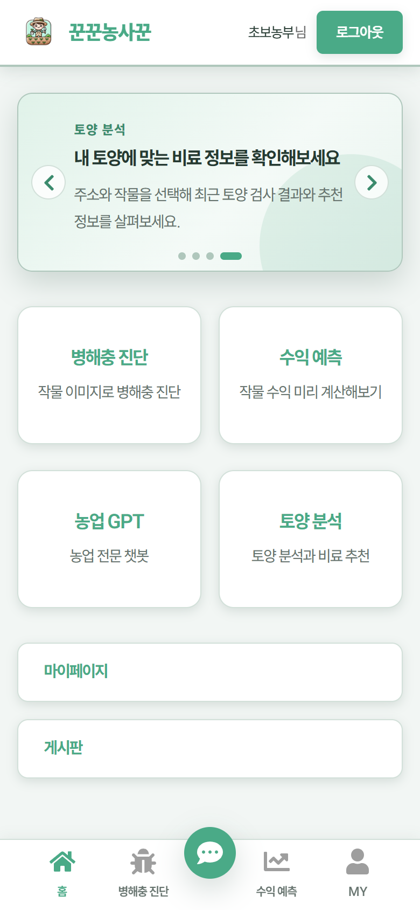
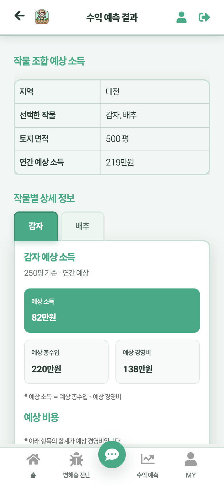
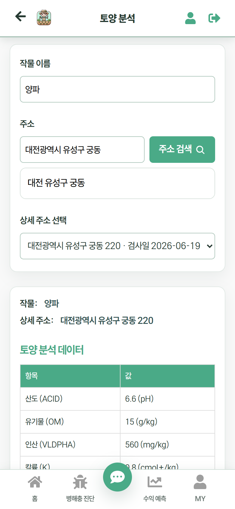
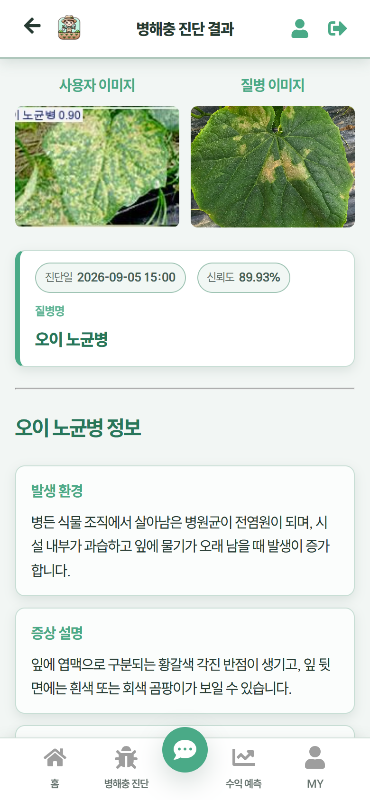
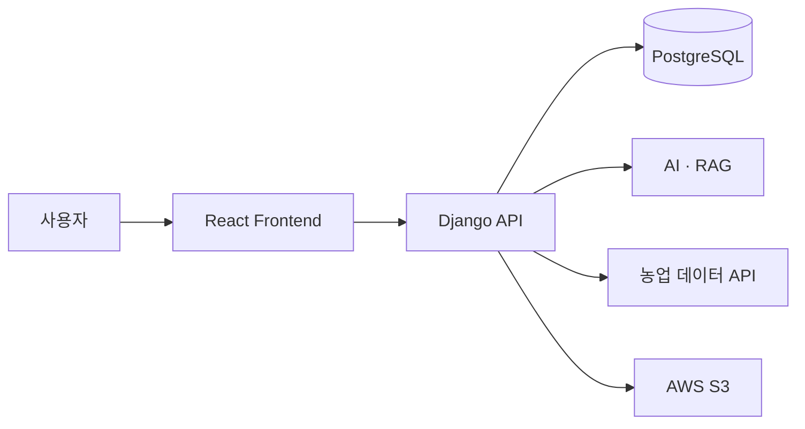

# 농업코파일럿

> AI와 공공데이터를 연결해 수익 분석, 병해충 진단, 토양검정과 영농 상담을 제공하는 초보 농업인 지원 서비스

[](https://github.com/minjuko/farm-copilot/actions/workflows/ci.yml)

KT AIVLE School 5기 Big Project에서 6명이 개발한 서비스입니다. 프로젝트 당시 서비스명은 **꾼꾼농사꾼**이며, **Collaboration상**을 수상했습니다.

저는 Frontend 개발자로 참여해 공통 UI와 인증·커뮤니티를 구현하고, 서로 다른 Backend·AI·공공데이터 기능을 사용자가 이용할 수 있는 화면 흐름으로 연결했습니다.

> 이 저장소는 원본 팀 저장소를 기반으로 실행환경, Frontend 구조, 테스트와 문서를 개선한 개인 Fork입니다. AI 모델과 Backend 전체 구현은 각 담당 팀원의 기여입니다.

## 프로젝트 정보

| 항목 | 내용 |
| --- | --- |
| 기간 | 2024.06.17–2024.07.30 |
| 인원 | 6명 — Frontend 2 · Backend 2 · AI/Server 2 |
| 본인 역할 | Frontend — 공통 UI · 주요 기능 연동 |
| 성과 | KT AIVLE School 5기 Big Project Collaboration상 |
| 원본 저장소 | [Frontend](https://github.com/kt-bigproject28/kunkunnongsakun) · [Backend](https://github.com/kt-bigproject28/bigproject28) |
| 상세 문서 | [농업코파일럿 상세 기술문서](https://app.notion.com/p/3d1622cea8638005938aca8f9f7d905c) |

## 주요 기능

| 기능 | 사용자 흐름 |
| --- | --- |
| 농작물 수익 분석 | 재배 조건 입력 → 예상 소득·시장가격 분석 → 차트 확인 |
| AI 병해충 진단 | 작물 이미지 업로드 → YOLO 분석 → 병해충 정보·진단 이력 확인 |
| 토양검정·비료 처방 | 농지 주소 입력 → 토양 시료 선택 → 작물별 처방 확인 |
| 농업 AI 챗봇 | 대화 세션 생성 → 질문 전송 → RAG 기반 답변·이력 확인 |
| 농업 커뮤니티 | 판매·구매 게시글과 댓글 작성·조회·수정·삭제 |
| 회원·마이페이지 | 회원가입·로그인, 회원정보와 사용자 활동 관리 |

## 서비스 화면

<table>
  <tr>
    <th width="50%">메인 화면</th>
    <th width="50%">농작물 수익 분석</th>
  </tr>
  <tr>
    <td align="center"></td>
    <td align="center"></td>
  </tr>
  <tr>
    <th>토양검정·비료 처방</th>
    <th>AI 병해충 진단</th>
  </tr>
  <tr>
    <td align="center"></td>
    <td align="center"></td>
  </tr>
</table>

> 화면 이미지는 팀 프로젝트 최종 시연 자료를 기준으로 구성했습니다.

## 기술 스택

| 영역 | 기술 |
| --- | --- |
| Frontend | React 18 · JavaScript · React Router · Axios · styled-components · Chart.js · Create React App |
| Backend | Python · Django 5 · Django REST Framework |
| Database·Storage | PostgreSQL · AWS S3 |
| AI·Data | ElasticNet · YOLOv8 · PyTorch · pandas · NumPy · scikit-learn |
| RAG | LangChain · Chroma · OpenAI |
| External Data | Kakao 주소 검색 · aT 가격정보 · 기상청 ASOS · 농촌진흥청 토양검정·비료사용처방 V2 |

## 본인 담당 및 기여

### 팀 프로젝트 당시

| 영역 | 담당 내용 |
| --- | --- |
| 공통 UI | MainLayout · TopBar · GNB · 주요 Route와 Navigation |
| 회원·인증 | 회원가입·로그인 · Django Session 연동 · 인증 상태 기반 UI |
| 마이페이지 | 회원정보 · 비밀번호 · 회원 탈퇴 · 사용자 활동 화면 |
| 커뮤니티 | 게시글·댓글 CRUD · Pagination · 작성자 기반 UI |
| 수익 분석 | 입력 Form · API 연동 · 결과 및 Chart 화면 |
| 병해충 진단 | 이미지 Upload · 분석 요청 · 결과 및 진단 이력 화면 |
| 토양검정 | 주소·작물 입력 · 토양 조회 · 시료 선택 · 비료 처방 연동 |
| AI 챗봇 | 대화 Session · Message UI · Chat API · 대화 이력 |
| 협업 | 화면 요구 데이터 확인 · Backend 담당자와 API Contract 조율 |

Frontend에서는 처리 방식이 다른 기능을 공통적으로 **입력 → 검증 → 요청 → Loading/Error/Empty → 결과**의 흐름으로 구성했습니다. AI 모델 개발과 Backend 전체 구현은 담당 범위에 포함하지 않습니다.

### 개선 작업

- Django Session을 인증 상태의 기준으로 사용하고 Route Guard 정리
- 화면과 HTTP 통신 책임을 기능별 API Module과 공통 Axios Instance로 분리
- 반복되는 비동기 상태와 외부 데이터의 Error·Empty State 구분
- 환경변수, Credential, Local·Production 설정 분리
- YOLO Model Artifact·Class Mapping과 RAG 활성화 조건 점검
- Frontend·Backend 회귀 테스트와 GitHub Actions CI 구성

## 핵심 설계

### Frontend API 구조

```text
Page · Component
       ↓
기능별 API Module
       ↓
공통 Axios Instance
       ↓
Django API
       ↓
Loading · Error · Empty · Result
```

Axios에 Session Cookie와 CSRF Token 전달을 공통 적용하고, Component는 사용자 입력과 화면 상태에 집중하도록 역할을 나눴습니다.

### AI·외부 데이터 연동



- 병해충 이미지는 `multipart/form-data`, 일반 요청은 JSON으로 전달합니다.
- AI와 외부 Provider는 Frontend에서 직접 호출하지 않고 Django API를 경유합니다.
- Local 기본 환경은 재현성을 위해 SQLite와 `FileSystemStorage`를 사용합니다.

## 테스트 및 품질 검증

2026.09.13 기준 GitHub Actions와 동일한 명령으로 검증했습니다.

| 검증 항목 | 결과 |
| --- | ---: |
| Frontend Test Suites | **30 / 30 passed** |
| Frontend Tests | **151 / 151 passed** |
| Backend Tests | **117 / 117 passed** |
| 실패·Skip | **0** |
| Frontend ESLint | **0 warnings** |
| Frontend Production Build | **passed** |
| Main JavaScript | **284.36 kB gzip** |
| CSS | **892 B gzip** |
| Ruff lint·format | **passed** |
| Django System Check | **0 issues** |
| Python Dependency Check | **passed** |
| GitHub Actions CI | **passed** |

CI는 Node.js 22.20.0과 Python 3.11.9에서 Frontend와 Backend를 독립적으로 검증합니다. SQLite와 테스트 전용 설정을 사용하므로 외부 Credential, AI Dependency와 Model Artifact 없이 실행할 수 있습니다.

실제 외부 Provider 호출, YOLO 추론, RAG 질의와 Production 인프라 통합은 각각 Credential·Artifact·운영 환경이 필요하므로 CI 결과에 포함하지 않습니다.

## Local 실행

### Backend

```bash
cd backend
python -m venv .venv
python -m pip install -r requirements-dev.txt
python manage.py migrate
python manage.py runserver
```

### Frontend

```bash
cd frontend
npm ci
npm start
```

기본 Backend 주소는 `http://127.0.0.1:8000`, Frontend 주소는 `http://localhost:3000`입니다.

```dotenv
REACT_APP_API_BASE_URL=http://localhost:8000
```

환경변수, 운영 Database·Storage, AI Artifact와 외부 API 설정은 [Local Setup Guide](./docs/SETUP.md)를 참고해 주세요.

## 검증 명령

```bash
# Frontend
cd frontend
npm ci
npm run lint
npm test -- --runInBand
npm run build

# Backend
cd backend
python -m pip install -r requirements-dev.txt
ruff check .
ruff format --check .
python manage.py check
python manage.py test
python -m pip check
```

## 문서

| 문서 | 내용 |
| --- | --- |
| [Local Setup Guide](./docs/SETUP.md) | Local 실행 · 환경변수 · Database · AI Artifact · 외부 API · Storage |
| [원본 README](./docs/archive/README-2024-original.md) | 2024년 원본 팀 저장소 README |
| [상세 기술문서](https://app.notion.com/p/3d1622cea8638005938aca8f9f7d905c) | 요구사항 · 설계 · 핵심 구현 · 문제 해결 · 개인 기여 |

## 현재 운영 상태

이 저장소는 Local 실행과 자동화 검증을 위한 공개 코드입니다. 공개 배포 완료 상태로 표시하지 않으며, 외부 서비스와 Production 환경은 별도 검증이 필요합니다.
